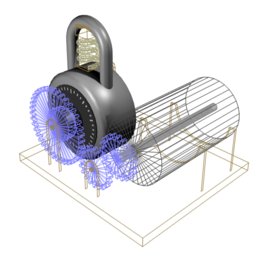

# inf-comb-seq-gen
multiparameter infinite combinatorial sequence generator

A kind of closed-form routine that quickly gives a logical set of values useful for solving a function where the parameter values are unknown.

It might be possible to find the lock combination of a lock by using:  
* n1 / (s - 1), -n2 / (s - 1) - 1, n3 / (s - 1)

"n#" are "set numbers" and "s" is the "set size".

Test program usage: prog [parameter count] [start] [end]
* [parameter count], 32 max
* [start] [end] == the range, 32-bit values

prog 9 4294967291 4294967295
* This will instantly return the last 5 possible set sizes and combinations for 9 parameters.

Applications
* testing code
* machine learning

NOTE: A lot of the mathematics in this code has to do with combinatorial numbers, triangle numbers, and base conversion.
